# Let's Go Makkah's Assignment 👋
This project is a Flight Booking Application built using MERN, Tailwind & Razorpay

<div style="
  display: grid;
  grid-template-columns: repeat(3, 1fr);
  gap: 30px;
">
  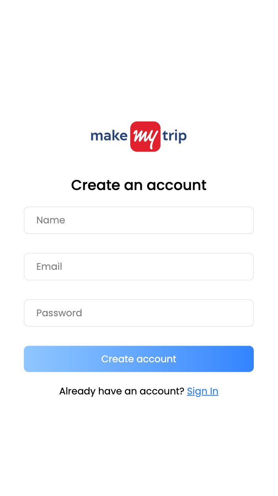
  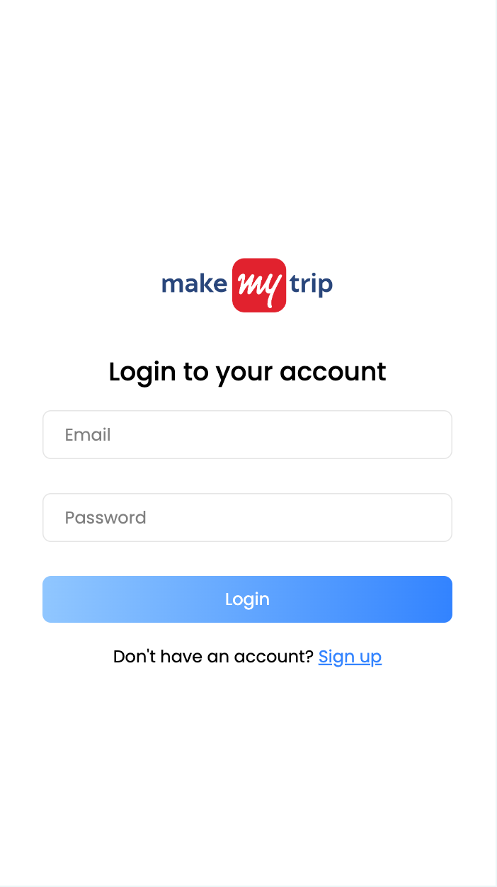
  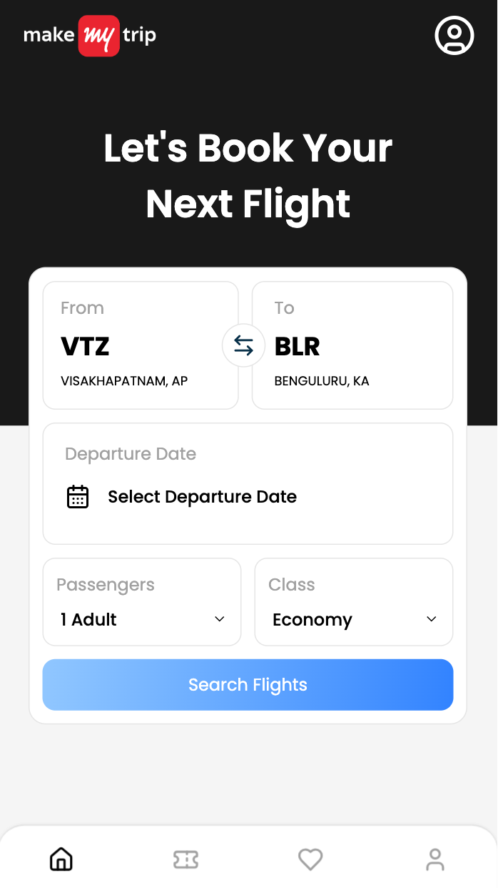
  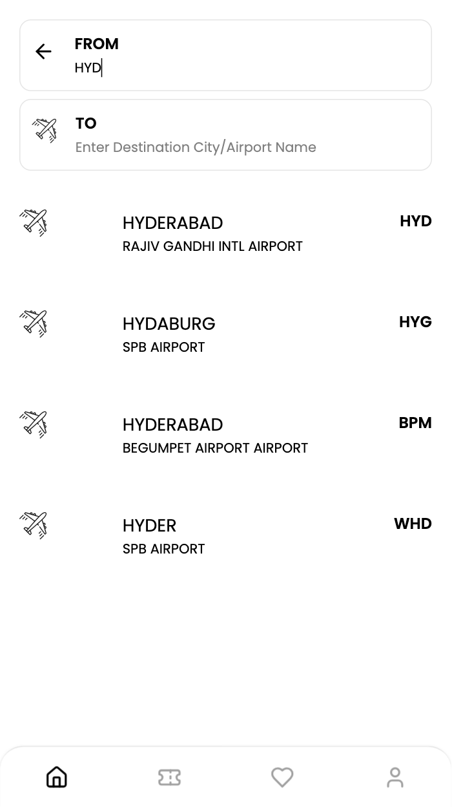
  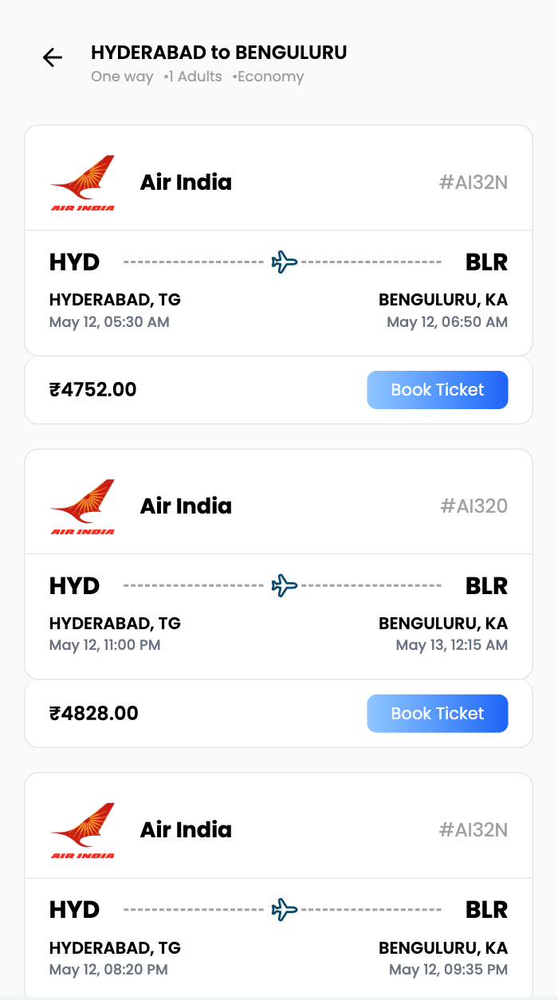
  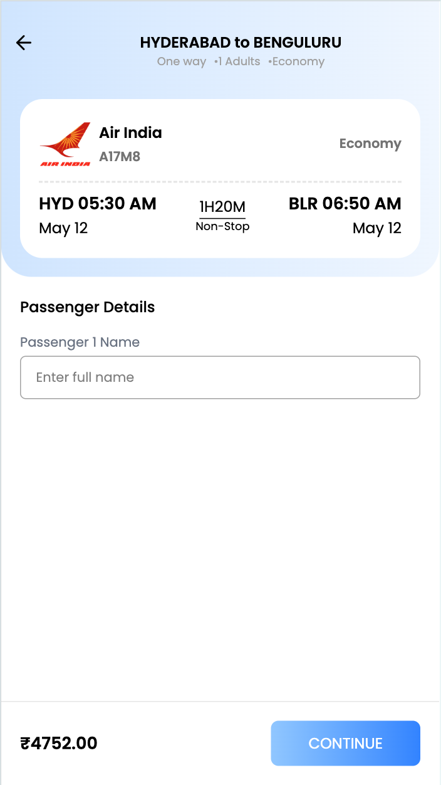
  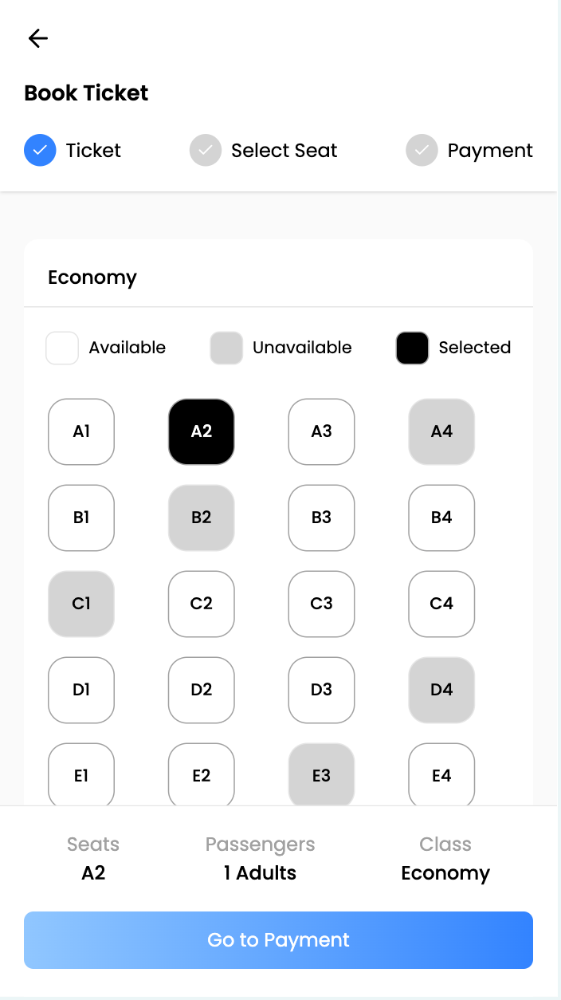
  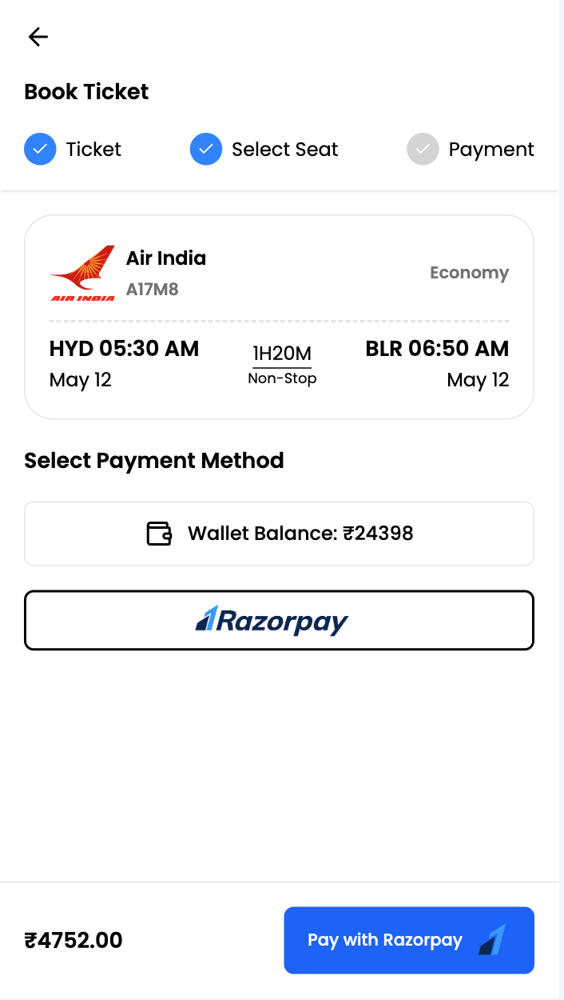
  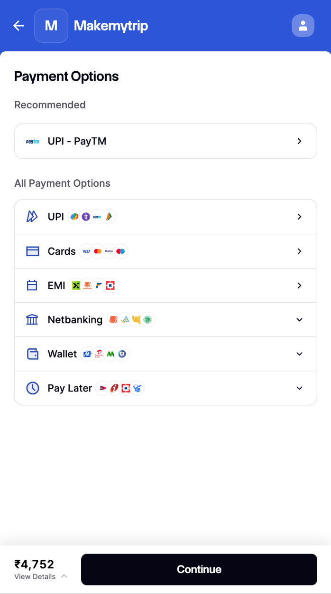
  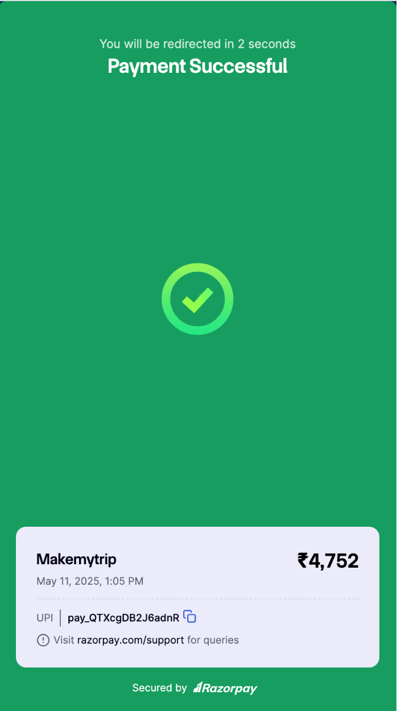
  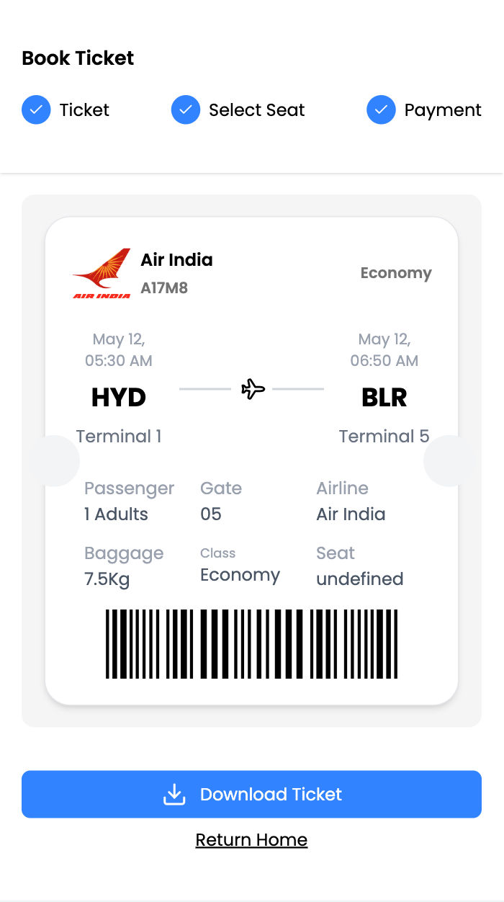
  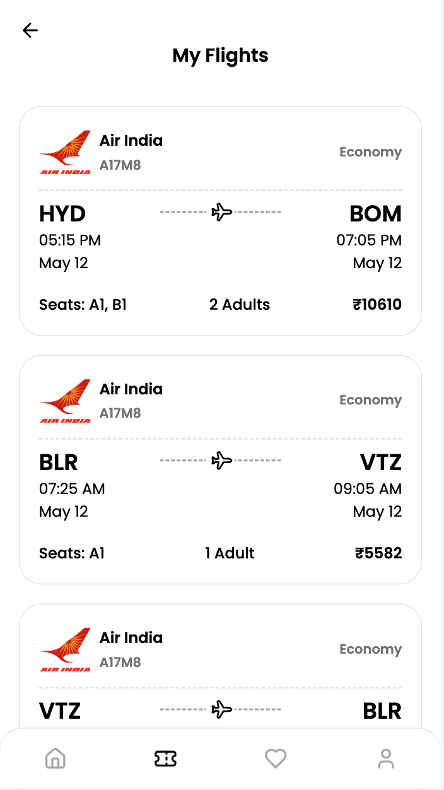
</div>


## Get Started
1. Clone the repository
```bash
git clone https://github.com/LEELAMANOHARGUDIVADA/taskboard.git
```

2. Navigate to client directory and install dependencies
```bash
cd client
npm install
```

3. Add a .env file in the root directory of client folder and add the below environment variables
```bash
VITE_API_URL='your-server-url'
VITE_RAZORPAY_KEY_ID='your-razorpay-id'
```

4. Navigate to server directory and install dependencies
```bash
cd server
npm install
```

5. Add a .env file in the root directory of server folder and add the below environment variables
```bash
PORT=8000
MONGODB_URI="your-mongodb-uri"
CLIENT_URL="your-client-url"
JWT_SECRET="your-jwt-secret"
EMAIL_USER='your-email-id'
EMAIL_PASSWORD='16 character app password'
AMADEUS_API_KEY='amadeus-api-key'
AMADEUS_API_SECRET='amadeus-api-secret'
RAZORPAY_KEY_ID='razorpay-key-id'
RAZORPAY_KEY_SECRET='razorpay-key-secret'
```

6. Now, you can start your client and server in their respective directories by running the command.
```bash
npm run dev
```
